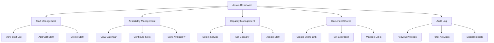

## 1. Product Overview

Admin management system for JyotirSetu platform to manage staff, availability, capacity, document sharing, and audit functionality. This system enables administrators to efficiently manage business operations and track system activities.

## 2. Core Features

### 2.1 User Roles

| Role  | Registration Method             | Core Permissions                                                                                                                               |
| ----- | ------------------------------- | ---------------------------------------------------------------------------------------------------------------------------------------------- |
| Admin | Manual creation by system owner | Full access to all admin functions including staff management, availability settings, capacity configuration, document sharing, and audit logs |
| Staff | Admin invitation/creation       | Limited access based on assigned role (consultant, manager, etc.)                                                                              |

### 2.2 Feature Module

Admin management system consists of the following essential pages:

1. **Staff Management**: View, add, edit, and delete staff members with role assignments
2. **Availability Management**: Configure staff availability schedules and time slots
3. **Capacity Management**: Set service capacity limits per staff member and service type
4. **Document Shares**: Create and manage secure document sharing links with expiration
5. **Audit Log**: Track document downloads and system activities for compliance

### 2.3 Page Details

| Page Name               | Module Name           | Feature description                                                                |
| ----------------------- | --------------------- | ---------------------------------------------------------------------------------- |
| Staff Management        | Staff List            | Display all staff members with name, email, phone, role, and creation date         |
| Staff Management        | Add/Edit Staff        | Form to create new staff or edit existing staff details (name, email, phone, role) |
| Staff Management        | Delete Staff          | Remove staff member from system with confirmation dialog                           |
| Availability Management | Availability Calendar | View and manage staff availability by date with time slot configuration            |
| Availability Management | Time Slots            | Add/edit time slots for specific dates with start/end times                        |
| Capacity Management     | Service Capacity      | Configure maximum appointments per time slot for each service and staff member     |
| Capacity Management     | Capacity Settings     | Set capacity limits with service type selection and staff assignment               |
| Document Shares         | Share Links           | Create secure sharing links for documents with expiration time settings            |
| Document Shares         | Link Management       | View active sharing links with expiration status and revoke access                 |
| Audit Log               | Download History      | Track document downloads with user information, timestamp, and IP address          |
| Audit Log               | Activity Timeline     | Display chronological audit trail of system activities and document access         |

## 3. Core Process

### Admin Flow

1. **Staff Management Flow**: Admin navigates to Staff page → Views staff list → Clicks "Add Staff" → Fills form → Saves new staff member → System creates staff record
2. **Availability Configuration Flow**: Admin navigates to Availability page → Selects staff member → Chooses date → Configures time slots → Saves availability → System updates staff schedule
3. **Capacity Setup Flow**: Admin navigates to Capacity page → Selects service type → Assigns staff member → Sets capacity limit → Saves configuration → System updates service capacity
4. **Document Sharing Flow**: Admin navigates to Document Shares → Selects document → Sets expiration time → Generates share link → System creates secure token → Link available for external access
5. **Audit Review Flow**: Admin navigates to Audit page → Views download history → Filters by date/user → Exports audit data → System provides activity reports

## 4. User Interface Design

### 4.1 Design Style

* **Primary Colors**: Dark theme with purple/blue gradients (#7c3aed to #22d3ee)

* **Secondary Colors**: Light grays for backgrounds (#f3f4f6, #e5e7eb)

* **Button Style**: Rounded corners with hover effects and shadow transitions

* **Font**: System fonts with 14-16px base size for readability

* **Layout Style**: Card-based layout with sidebar navigation

* **Icons**: FontAwesome icons for consistent visual language

### 4.2 Page Design Overview

| Page Name               | Module Name        | UI Elements                                                                   |
| ----------------------- | ------------------ | ----------------------------------------------------------------------------- |
| Staff Management        | Staff List         | Table with sortable columns, action buttons (Edit/Delete), search/filter bar  |
| Staff Management        | Add/Edit Form      | Modal dialog with form fields, validation messages, save/cancel buttons       |
| Availability Management | Calendar View      | Date picker with staff selection dropdown, time slot grid layout              |
| Availability Management | Time Slot Editor   | Input fields for start/end times, add/remove slot buttons, save functionality |
| Capacity Management     | Capacity Grid      | Table showing service types, staff assignments, and capacity settings         |
| Capacity Management     | Configuration Form | Dropdown selectors for service and staff, numeric input for capacity limit    |
| Document Shares         | Share Creation     | Document selector, expiration time input (hours), generate link button        |
| Document Shares         | Active Links       | Table showing share tokens, expiration dates, document names, revoke actions  |
| Audit Log               | Activity Table     | Sortable table with download history, user info, timestamps, IP addresses     |
| Audit Log               | Filter Controls    | Date range picker, user search, export button for audit data                  |

### 4.3 Responsiveness

* **Desktop-first approach**: Optimized for desktop admin workflows

* **Mobile-adaptive**: Basic functionality accessible on tablets and mobile devices

* **Touch interaction**: Buttons and controls sized appropriately for touch interfaces

* **Responsive tables**: Horizontal scrolling for data tables on smaller

