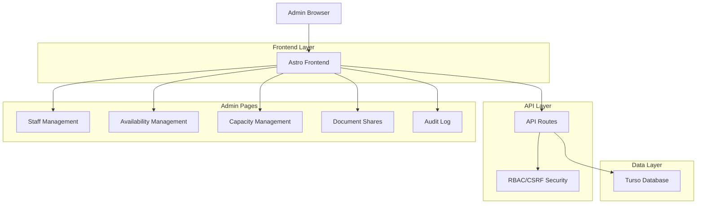
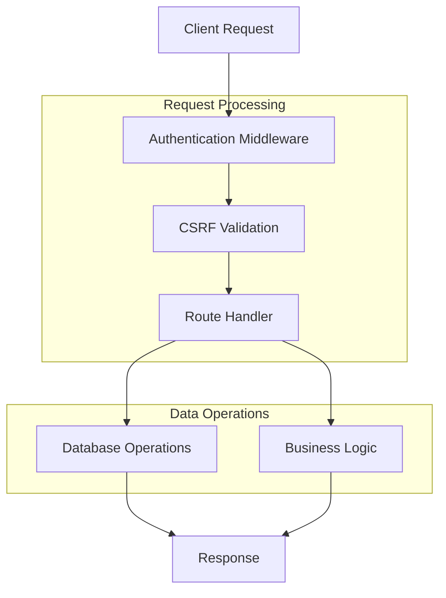

## 1. Architecture design



## 2. Technology Description
- **Frontend**: Astro@4 + HTML/CSS/JavaScript with Bootstrap 5
- **Backend**: API Routes (Astro server-side rendering)
- **Database**: Turso (SQLite-compatible edge database)
- **Authentication**: Session-based with RBAC (Role-Based Access Control)
- **Security**: CSRF protection on all POST endpoints

## 3. Route definitions
| Route | Purpose |
|-------|---------|
| /admin/staff | Staff management page - view and manage staff members |
| /admin/availability | Availability management - configure staff schedules |
| /admin/capacity | Capacity management - set service capacity limits |
| /admin/documents/share | Document sharing - create and manage share links |
| /admin/documents/audit | Audit log - view document download history |
| /api/admin/staff | CRUD operations for staff management |
| /api/admin/availability | Manage staff availability schedules |
| /api/admin/capacity | Configure service capacity settings |
| /api/admin/documents-share | Create and validate document share links |
| /api/admin/documents-audit | Log and retrieve document access events |

## 4. API definitions

### 4.1 Staff Management API

**GET /api/admin/staff**
- Purpose: Retrieve staff members
- Query Parameters: `id` (optional) - specific staff member ID
- Response: `{ ok: boolean, data: Staff[] | Staff }`

**POST /api/admin/staff**
- Purpose: Create/update/delete staff members
- Body: `{ action: 'upsert'|'delete', id?: string, name: string, email?: string, phone?: string, role: string }`
- Response: `{ ok: boolean, id?: string, error?: string }`

### 4.2 Availability Management API

**GET /api/admin/availability**
- Purpose: Retrieve availability schedules
- Query Parameters: `staff_id`, `date` (optional filters)
- Response: `{ ok: boolean, data: Availability[] }`

**POST /api/admin/availability**
- Purpose: Create/update availability slots
- Body: `{ staff_id: string, date: string, slots: Array<{start: string, end: string}> }`
- Response: `{ ok: boolean, id?: string, error?: string }`

### 4.3 Capacity Management API

**GET /api/admin/capacity**
- Purpose: Retrieve capacity settings
- Query Parameters: `service` (optional filter)
- Response: `{ ok: boolean, data: Capacity[] }`

**POST /api/admin/capacity**
- Purpose: Create/update capacity settings
- Body: `{ id?: string, staff_id?: string, service: string, capacity_per_slot: number }`
- Response: `{ ok: boolean, id?: string, error?: string }`

### 4.4 Document Sharing API

**GET /api/admin/documents-share**
- Purpose: Validate share link token
- Query Parameters: `token` (required)
- Response: `{ ok: boolean, data?: ShareLink, error?: string }`

**POST /api/admin/documents-share**
- Purpose: Create new share link
- Body: `{ document_id: string, ttl_hours: number }`
- Response: `{ ok: boolean, token: string, expires_at: string, error?: string }`

### 4.5 Document Audit API

**POST /api/admin/documents-audit**
- Purpose: Log document download event
- Body: `{ document_id: string, by_user?: string }`
- Response: `{ ok: boolean, id: string, error?: string }`

## 5. Server architecture diagram



## 6. Data model

### 6.1 Database Schema

```mermaid
erDiagram
    STAFF ||--o{ STAFF_AVAILABILITY : has
    STAFF ||--o{ STAFF_CAPACITY : configures
    DOCUMENT ||--o{ DOCUMENT_SHARE_LINKS : generates
    DOCUMENT ||--o{ DOCUMENT_DOWNLOADS : tracked_by

    STAFF {
        string id PK
        string name
        string email
        string phone
        string role
        string created_at
        string updated_at
    }
    
    STAFF_AVAILABILITY {
        string id PK
        string staff_id FK
        string date
        string slots JSON
        string created_at
        string updated_at
    }
    
    STAFF_CAPACITY {
        string id PK
        string staff_id FK
        string service
        int capacity_per_slot
        string created_at
        string updated_at
    }
    
    DOCUMENT_SHARE_LINKS {
        string token PK
        string document_id FK
        string expires_at
        string created_at
    }
    
    DOCUMENT_DOWNLOADS {
        string id PK
        string document_id FK
        string by_user
        string downloaded_at
        string ip
    }
```

### 6.2 Data Definition Language

**Staff Table**
```sql
CREATE TABLE staff (
    id TEXT PRIMARY KEY,
    name TEXT NOT NULL,
    email TEXT,
    phone TEXT,
    role TEXT NOT NULL DEFAULT 'consultant',
    created_at TEXT NOT NULL,
    updated_at TEXT NOT NULL
);
CREATE INDEX idx_staff_role ON staff(role);
```

**Staff Availability Table**
```sql
CREATE TABLE staff_availability (
    id TEXT PRIMARY KEY,
    staff_id TEXT NOT NULL,
    date TEXT NOT NULL,
    slots JSON,
    created_at TEXT NOT NULL,
    updated_at TEXT NOT NULL,
    FOREIGN KEY (staff_id) REFERENCES staff(id)
);
CREATE INDEX idx_staff_availability_staff_date ON staff_availability(staff_id, date);
```

**Staff Capacity Table**
```sql
CREATE TABLE staff_capacity (
    id TEXT PRIMARY KEY,
    staff_id TEXT,
    service TEXT NOT NULL,
    capacity_per_slot INTEGER NOT NULL DEFAULT 1,
    created_at TEXT NOT NULL,
    updated_at TEXT NOT NULL,
    FOREIGN KEY (staff_id) REFERENCES staff(id)
);
CREATE INDEX idx_staff_capacity_service ON staff_capacity(service);
```

**Document Share Links Table**
```sql
CREATE TABLE document_share_links (
    token TEXT PRIMARY KEY,
    document_id TEXT NOT NULL,
    expires_at TEXT,
    created_at TEXT NOT NULL,
    FOREIGN KEY (document_id) REFERENCES documents(id)
);
CREATE INDEX idx_doc_share_expires ON document_share_links(expires_at);
```

**Document Downloads Table**
```sql
CREATE TABLE document_downloads (
    id TEXT PRIMARY KEY,
    document_id TEXT NOT NULL,
    by_user TEXT,
    downloaded_at TEXT NOT NULL,
    ip TEXT,
    FOREIGN KEY (document_id) REFERENCES documents(id)
);
CREATE INDEX idx_doc_downloads_doc ON document_downloads(document_id);
```