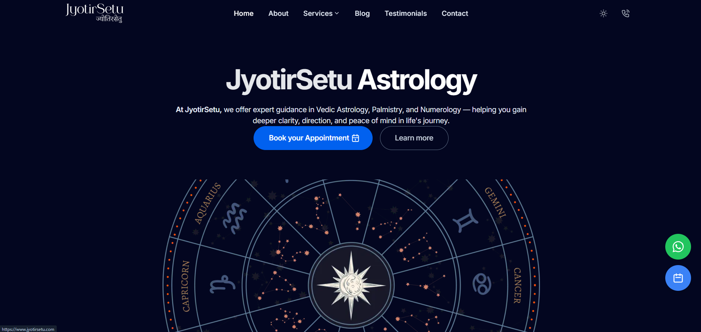
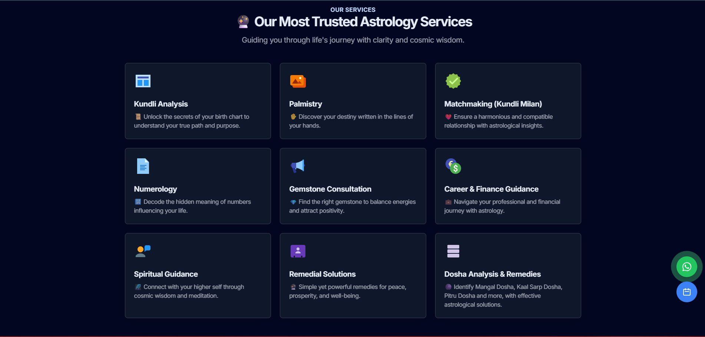
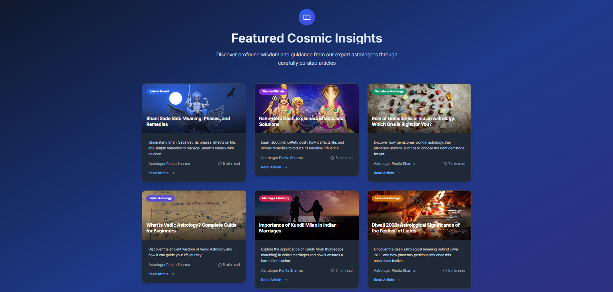

# 🌟 JyotirSetu Astrology - Bridge to Cosmic Light

[](https://www.jyotirsetu.com)
[](https://www.blog.jyotirsetu.com)
[](LICENSE.md)

> Professional astrology, palmistry & numerology consultations by Astrologer Punita Sharma. Get expert guidance for your life journey.

## ��️ **Website Preview**

### **Homepage**


_Modern, responsive homepage showcasing our astrology services and expert guidance_

### **Services Page**


_Comprehensive overview of all our astrology services including Kundli Analysis, Palmistry, Numerology, and more_

### **About Page**


_Learn about our expert Astrologer Punita Sharma and her 25+ years of experience_

### **Blog**


_Expert astrology insights, remedies, and cosmic guidance on our dedicated blog_

## 🚀 **Live Website**

- **Main Website**: [www.jyotirsetu.com](https://www.jyotirsetu.com)
- **Blog**: [www.blog.jyotirsetu.com](https://www.blog.jyotirsetu.com)

## ✨ **About JyotirSetu**

JyotirSetu is a professional astrology consultation platform offering expert guidance in:

- **Vedic Astrology** - Birth chart analysis and predictions
- ✋ **Palmistry** - Hand reading and destiny analysis
- 🔢 **Numerology** - Number-based life guidance
- 💎 **Gemstone Consultation** - Personalized gemstone recommendations
- ❤️ **Matchmaking (Kundli Milan)** - Relationship compatibility analysis
- 💼 **Career & Finance Guidance** - Professional and financial insights
- **Spiritual Guidance** - Meditation and spiritual counseling
- **Remedial Solutions** - Astrological remedies and solutions
- **Dosha Analysis** - Mangal Dosha, Kaal Sarp Dosha, and more

## ��‍ **Our Expert**


**Astrologer Punita Sharma** - M.A. Sanskrit

- ✅ Certified Astrologer – Bharatiya Vidya Bhavan
- ✅ Diploma in Palmistry – Indian Council of Astrological Sciences (ICAS)
- ✅ Certified Numerologist – All India Federation of Astrologers' Societies (AIFAS)
- ✅ Life Member – Astrological Research Project, Kolkata
- ✅ 25+ Years of Experience
- ✅ Trusted by clients across India and abroad

## 🏢 **Our Office**


_Professional consultation space in Sector-15, Gurugram, Haryana_

## 🛠️ **Technology Stack**

### **Frontend**

- **Framework**: [Astro 5.0](https://astro.build/) - Modern static site generator
- **Styling**: [Tailwind CSS](https://tailwindcss.com/) - Utility-first CSS framework
- **Icons**: [Tabler Icons](https://tabler-icons.io/) & [Flat Color Icons](https://iconify.design/)
- **Typography**: [Inter Font](https://rsms.me/inter/) - Modern, readable font

### **Backend & Deployment**

- **Hosting**: [Vercel](https://vercel.com/) - Edge-first platform
- **Analytics**: [Vercel Analytics](https://vercel.com/analytics) & [Speed Insights](https://vercel.com/speed-insights)
- **Database**: [Supabase](https://supabase.com/) - Open source Firebase alternative
- **Email**: [Resend](https://resend.com/) - Modern email API

### **SEO & Performance**

- **SEO**: [AstroLib SEO](https://github.com/onwidget/astrolib) - Advanced SEO optimization
- **Sitemap**: Automatic XML sitemap generation
- **Compression**: [Astro Compress](https://github.com/astro-community/astro-compress) - Asset optimization
- **Images**: [Unpic](https://unpic.pics/) - Universal image optimization

## **Project Structure**

JyotirSetu-2.0-main/
├── src/
│ ├── components/ # Reusable UI components
│ │ ├── widgets/ # Page-specific components
│ │ └── ui/ # Basic UI elements
│ ├── layouts/ # Page layouts
│ ├── pages/ # Website pages
│ ├── assets/ # Images, icons, etc.
│ ├── config.yaml # Site configuration
│ └── navigation.ts # Navigation structure
├── images/ # README images
│ ├── screenshots/ # Website screenshots
│ ├── expert/ # Expert photos
│ ├── office/ # Office photos
│ └── logo/ # Logo files
├── public/ # Static assets
├── astro.config.ts # Astro configuration
├── vercel.json # Vercel deployment config
└── package.json # Dependencies

## **Getting Started**

### **Prerequisites**

- Node.js >= 20.0.0
- npm or yarn

### **Installation**

1. **Clone the repository**

   ```bash
   git clone https://github.com/yourusername/jyotirsetu-website.git
   cd jyotirsetu-website
   ```

2. **Install dependencies**

   ```bash
   npm install
   ```

3. **Start development server**

   ```bash
   npm run dev
   ```

4. **Open your browser**
   ```
   http://localhost:4321
   ```

### **Available Scripts**

```bash
# Development
npm run dev          # Start development server
npm run start        # Start development server (alias)

# Building
npm run build        # Build for production
npm run preview      # Preview production build

# Code Quality
npm run check        # Run all checks
npm run check:astro  # Check Astro files
npm run check:eslint # Check JavaScript/TypeScript
npm run check:prettier # Check code formatting

# Fixing
npm run fix          # Fix all fixable issues
npm run fix:eslint   # Fix ESLint issues
npm run fix:prettier # Fix Prettier formatting
```

## 🌐 **Deployment**

### **Vercel (Recommended)**

1. **Connect to Vercel**
   - Push your code to GitHub
   - Connect your repository to Vercel
   - Deploy automatically

2. **Environment Variables**
   ```bash
   # Add these in Vercel dashboard
   SUPABASE_URL=your_supabase_url
   SUPABASE_ANON_KEY=your_supabase_anon_key
   RESEND_API_KEY=your_resend_api_key
   ```

### **Other Platforms**

The site can be deployed to any static hosting platform:

- Netlify
- GitHub Pages
- Cloudflare Pages
- AWS S3 + CloudFront

## 📧 **Contact & Support**

- **Website**: [www.jyotirsetu.com](https://www.jyotirsetu.com)
- **Email**: guidance@jyotirsetu.com
- **Phone**: +91-9266991298
- **Address**: 40A/5, Sector-15, Part-2, Gurugram, Haryana

## 🔧 **Configuration**

### **Site Settings**

Edit `src/config.yaml` to customize:

- Site name and description
- SEO metadata
- Social media links
- Analytics configuration

### **Navigation**

Edit `src/navigation.ts` to modify:

- Header navigation
- Footer links
- Social media links

### **Styling**

- **Colors**: Edit `tailwind.config.js`
- **Components**: Modify files in `src/components/`
- **Layouts**: Update files in `src/layouts/`

## 📊 **Performance Features**

- ⚡ **Fast Loading** - Astro's zero-JS by default approach
- 🖼️ **Image Optimization** - Automatic image compression and lazy loading
- **Mobile First** - Responsive design for all devices
- **SEO Optimized** - Meta tags, structured data, sitemaps
- ♿ **Accessible** - WCAG compliant design
- 🌐 **PWA Ready** - Progressive Web App capabilities

## 🛡️ **Security**

- **Admin Protection** - Secure admin panel with authentication
- **Headers** - Security headers for admin routes
- **HTTPS** - SSL/TLS encryption
- **Input Validation** - Form validation and sanitization

## 📈 **Analytics & Monitoring**

- **Vercel Analytics** - Real-time performance metrics
- **Speed Insights** - Core Web Vitals monitoring
- **Google Analytics** - User behavior tracking (configurable)
- **Error Tracking** - Automatic error reporting

## **Contributing**

1. Fork the repository
2. Create a feature branch (`git checkout -b feature/amazing-feature`)
3. Commit your changes (`git commit -m 'Add amazing feature'`)
4. Push to the branch (`git push origin feature/amazing-feature`)
5. Open a Pull Request

## 📄 **License**

This project is licensed under the MIT License - see the [LICENSE.md](LICENSE.md) file for details.

## **Acknowledgments**

- Built with [AstroWind](https://github.com/onwidget/astrowind) template
- Icons by [Tabler Icons](https://tabler-icons.io/)
- Font by [Inter](https://rsms.me/inter/)
- Hosted on [Vercel](https://vercel.com/)

---

<div align="center">

**🌟 JyotirSetu Astrology - Bridging Cosmic Light with Modern Guidance 🌟**

[Website](https://www.jyotirsetu.com) • [Blog](https://www.blog.jyotirsetu.com) • [Contact](https://www.jyotirsetu.com/contact)

</div>
